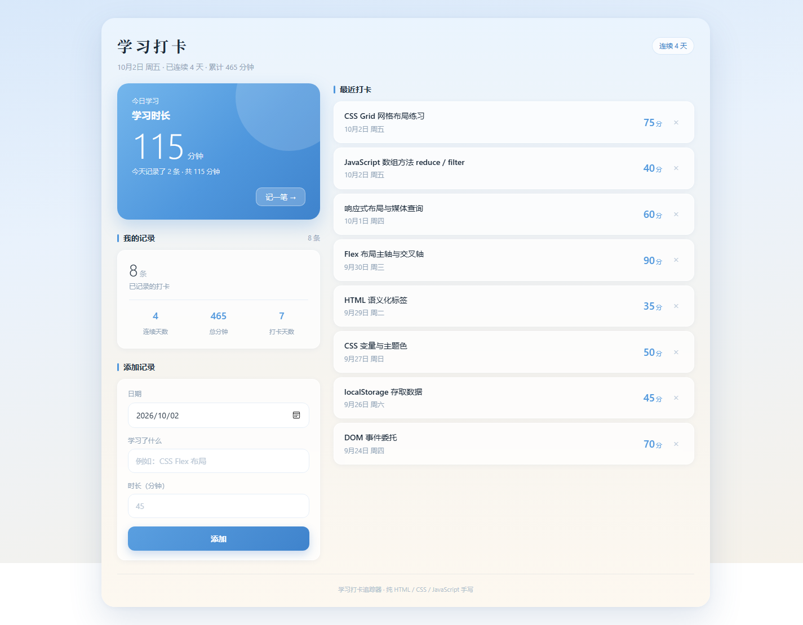
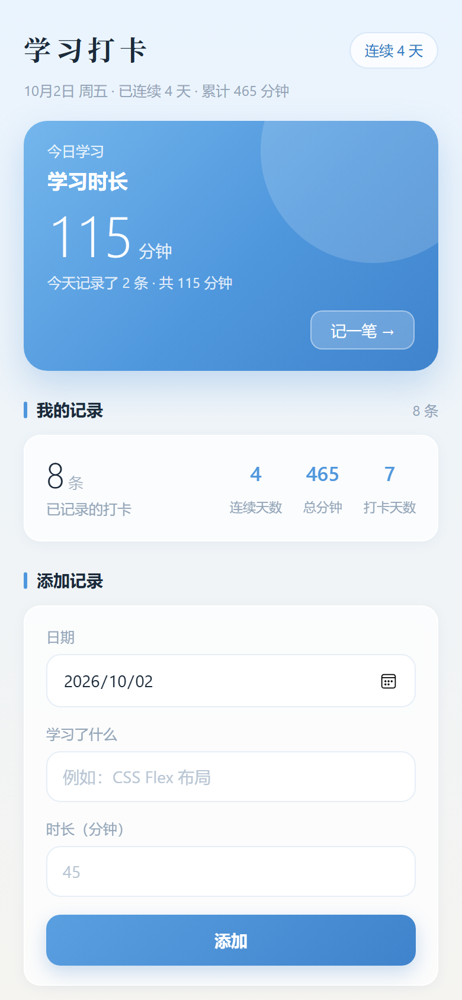

# 学习打卡追踪器

一个用来记录每天学习内容和时长的网页小工具。数据保存在浏览器本地，刷新和关闭页面都不会丢。

这是我学习前端后独立完成的第一个完整项目，目的是把「HTML 结构 + CSS 样式 + JavaScript 逻辑」串起来练一遍。

## 功能

- **添加记录**：填写日期、学习内容、学习时长，点「添加」即可
- **自动统计**：实时显示总打卡次数、连续打卡天数、累计学习时长、今日是否已打卡
- **删除记录**：点每条记录右侧的「删除」按钮
- **本地持久化**：数据存在 `localStorage`，关掉浏览器再打开还在
- **响应式布局**：手机上单栏铺满，桌面（≥800px）自动变成左右分栏

## 界面

**桌面端** —— 左边填记录，右边看列表：



**手机端** —— 去掉外框铺满整屏，单栏堆叠：



## 技术栈

- HTML5
- CSS3（CSS 变量、Flexbox、Grid、媒体查询）
- 原生 JavaScript（DOM 操作、事件委托、localStorage）

没有使用任何框架和第三方库。

## 在线体验

🔗 https://qiangugu0226.github.io/study-tracker/

## 本地运行

不需要安装任何东西，两种方式任选：

**方式一**：直接双击 `index.html`

**方式二**：用 VS Code 打开文件夹，右键 `index.html` → 「Open with Live Server」

```bash
git clone https://github.com/Qiangugu0226/study-tracker.git
cd study-tracker
```

## 项目结构

```
study-tracker/
├── index.html            # 页面结构
├── css/
│   └── style.css         # 样式
├── js/
│   └── app.js            # 逻辑
├── screenshot.png        # 桌面端截图
├── screenshot-mobile.png # 手机端截图
├── .gitignore
└── README.md
```

## 实现思路

**数据流是单向的**：所有操作都先改 `records` 数组，然后调用 `saveRecords()` 存进 localStorage，再调用 `render()` 重新渲染整个列表。

这样做的好处是不用关心「页面上现在是什么状态」——页面永远是 `records` 数组的投影，不会出现数据和界面对不上的情况。

**删除按钮用事件委托**。列表是动态渲染的，如果给每个删除按钮单独绑事件，每次重新渲染后都要重新绑一遍。改成在 `<ul>` 上监听、用 `event.target.closest()` 找到被点的按钮，就只需要绑一次。

**连续打卡天数**的逻辑：把有记录的日期去重后倒序排列，先判断最近一天是不是今天或昨天（不是就说明已经断了），然后从最近往前逐天比对，遇到不连续的就停。

**响应式分三档**。手机（≤480px）去掉卡片外框、铺满整屏；平板（481~799px）居中一块窄卡片；桌面（≥800px）变成两栏栅格 —— 左栏放「今日概览 + 统计 + 表单」，右栏放「打卡列表」，也就是把「输入」和「输出」分开。

切换只靠一条媒体查询。承载分栏的 `.col-left` / `.col-right` 在手机上就是普通块级元素，没有任何样式，所以小屏的排版和加桌面样式之前一模一样。

## 关键实现说明

下面三处是代码里最需要解释的地方，也是我自己最想讲清楚的部分。

### 1. 用户输入先转义，再拼进页面

列表是用 `innerHTML` 拼出来的。这意味着用户输入会被浏览器当成 **HTML 代码**解析，而不是普通文字 —— 输入 `<b>粗体</b>` 会真的变粗，输入 `` 会执行脚本。

所以拼接之前，内容统一走一遍 `escapeHtml()`，把 `&`、`<`、`>`、`"` 转成 HTML 实体：

```js
function escapeHtml(str) {
  return String(str)
    .replace(/&/g, '&amp;')
    .replace(/</g, '&lt;')
    .replace(/>/g, '&gt;')
    .replace(/"/g, '&quot;');
}
```

这是 XSS（跨站脚本）防护的基本动作：**只要往页面里插入用户输入，就必须处理**。用 `textContent` 赋值本身是安全的，但这里要拼一整段列表结构，用了 `innerHTML`，所以手动转义。

### 2. 删除按钮用事件委托，而不是逐个绑定

如果给每个删除按钮单独绑事件（`querySelectorAll('.btn-delete')`），会有一个问题：每次增删记录都会重新执行 `render()`，而 `render()` 是把整个 `<ul>` 的 `innerHTML` 换掉 —— 旧按钮被扔掉了，绑在它们身上的监听器也跟着一起消失。

改成在 `<ul>` 上绑**一个**监听器，再用 `event.target.closest()` 反查这次点击落在哪个按钮上：

```js
// js/app.js:215
listEl.addEventListener('click', function (event) {
  const btn = event.target.closest('[data-action="delete"]');
  if (!btn) return;

  const item = btn.closest('.record-item');
  const id = item.dataset.id;

  records = records.filter(function (r) { return r.id !== id; });
  saveRecords(records);
  render(records);
});
```

好处是监听器只绑一次，列表怎么重渲染都不用管。这个模式叫**事件委托**，列表越长、越动态，它越划算。

### 3. 日期相减前必须先转成 Date 对象

算「连续打卡天数」时要比较两个日期差多少天。但 `'2026-10-01' - '2026-09-30'` 得到的是 `NaN`，因为字符串不支持减法。

正确做法是先转成真正的 `Date` 对象，两个 `Date` 相减才会得到毫秒数，再除以一天的毫秒数：

```js
// js/app.js:44
const d = new Date(dateStr + 'T00:00:00');

// js/app.js:68, js/app.js:80
const oneDay = 24 * 60 * 60 * 1000;
const diffDays = Math.round((cursor - prev) / oneDay);
```

**末尾的 `T00:00:00` 不能省。** 只写 `new Date('2026-10-01')` 时，JS 会把这种纯日期字符串按 **UTC** 解析；补上 `T00:00:00` 之后才按**本地时区**解析。这个项目取的是本地日期，所以在西半球时区（比如 UTC-5）下，UTC 午夜对应的是前一天晚上 7 点，`getDate()` 会少一天。

## 后续想做的

- [ ] 按周/月查看统计图表
- [ ] 给记录加标签分类
- [ ] 支持编辑已有记录
- [ ] 导出为 CSV

## 作者

Cheguu（[@Qiangugu0226](https://github.com/Qiangugu0226)）
